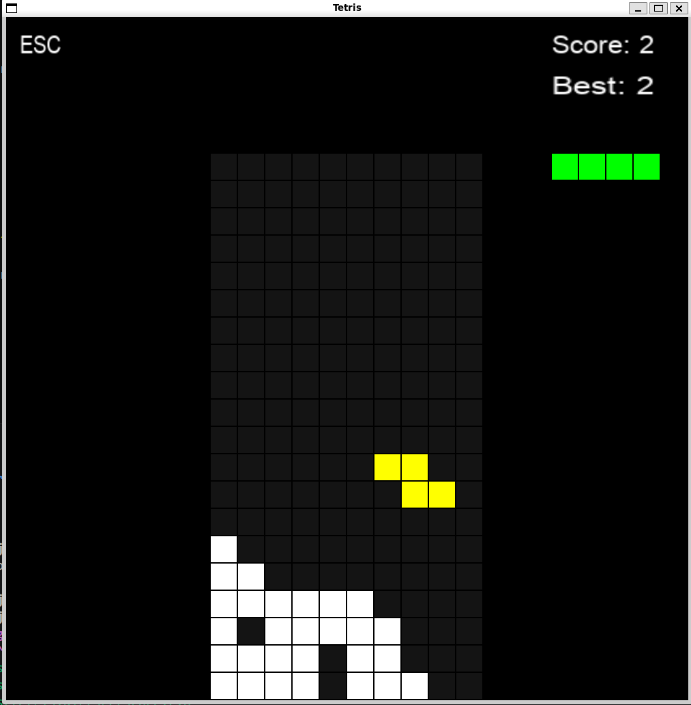

# 🎮 Tetris (SDL2)

## 🖼️ Screenshot

  

## 🇨🇿 Čeština

### 🧩 O projektu
Tento projekt je klon klasického Tetrisu napsaný v jazyce C pomocí knihovny SDL2.

### ⚙️ Spuštění
Nejdříve je potřeba nainstalovat SDL2 knihovny:

sudo apt install libsdl2-dev libsdl2-ttf-dev libsdl2-mixer-dev

Poté spusť build pomocí CMake:

mkdir build
cd build
cmake ..
make

Spuštění hry:

./tetris

### 🎮 Ovládání
Šipky nebo WASD slouží pro pohyb a otáčení bloků. Klávesa ESC vrací zpět do menu.

### 🕹️ Hra
Hra je předělávka klasického Tetrisu. Náhodně generovaná tetromina padají dolů a po dopadu se uloží na hrací plochu. Pokud se vytvoří celý řádek, je odstraněn a hráč získá body. Pokud není možné umístit nový blok, hra končí.

### ⚙️ Menu
V menu lze nastavit tři obtížnosti (Easy, Medium, Hard), vybrat hudbu na pozadí a upravit hlasitost. Ovládání menu je možné pomocí myši nebo klávesy ESC.

---

## 🇬🇧 English

### 🧩 About the project
This project is a classic Tetris clone written in C using the SDL2 library.

### ⚙️ Build & Run
First install required SDL2 libraries:

sudo apt install libsdl2-dev libsdl2-ttf-dev libsdl2-mixer-dev

Then build the project using CMake:

mkdir build
cd build
cmake ..
make

Run the game:

./tetris

### 🎮 Controls
Arrow keys or WASD are used to move and rotate pieces. ESC returns to the menu.

### 🕹️ Gameplay
This is a classic Tetris implementation where randomly generated tetromino pieces fall down. When a line is completed, it is cleared and the player gains points. The game ends when no new piece can be placed.

### ⚙️ Menu
The menu allows selection of three difficulty levels (Easy, Medium, Hard), background music selection, and volume adjustment. Navigation is done using the mouse or ESC key.